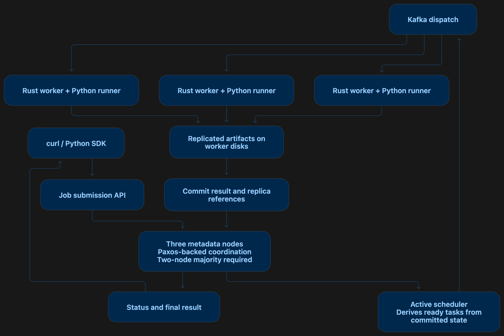

# ShardWise

**Distributed AI and data-processing workflows, designed to preserve progress through failures.**


[](https://github.com/VedPanse/shardwise/stargazers)

ShardWise is a distributed execution framework in development for long-running workloads on hardware you own. The goal: submit a task graph, execute independent tasks across workers, and retrieve the result even after a coordinator or worker fails.

**Today:** the Rust API accepts jobs, queues them in memory, and serves status and health endpoints. Dependency scheduling is implemented and tested; worker dispatch, consensus, and replicated storage are not yet integrated. Jobs remain `queued`; restarting the server loses them.

## What we're building

- **Dependency-aware execution:** Rust schedules ready tasks; Python runs user functions and their libraries. Workloads define their partitions and dependencies—arbitrary functions are not automatically parallelized.
- **Durable coordination:** a Paxos-inspired replicated metadata log preserves accepted jobs, assignments, and result commits. Three metadata nodes require a two-node majority to advance state.
- **Replicated worker storage:** inputs and outputs live on worker disks, separately from metadata. Results commit only after meeting the configured replication requirement; surviving copies support recovery and repair.
- **Automatic recovery:** detect failed workers, retry interrupted tasks, and reject stale or duplicate result commits. Execution may repeat; external side effects require idempotency.

Intended workloads include partitioned data transformations, batch inference, model evaluation, and gradient-computation graphs. A Python decorator SDK will build and submit graphs; curl is the initial interface.

## Why ShardWise alongside Dask?

**Our intended advantage is durable workflow recovery after coordinator failure.** That matters when recomputing hours of work is expensive. It is a design target, not a demonstrated performance or reliability win yet.

| Concern | Dask Distributed today | ShardWise target |
| --- | --- | --- |
| Scheduler failure | Ongoing computation records are lost; scheduler state has no built-in persistence for recovery | Recover committed workflow state through a surviving metadata quorum |
| Worker/data loss | Reschedules work, recomputes lost results, and supports data replication | Recover from durable worker replicas, repair missing copies, and retry interrupted tasks |
| Local deployment | Runs on a laptop or self-managed cluster; no paid service required | Develop locally and deploy on owned hardware; no cloud dependency |

Sources: [Dask resilience](https://distributed.dask.org/en/latest/resilience.html) and [deployment options](https://docs.dask.org/en/latest/deploying.html), checked September 2026.

Dask already provides mature parallel execution. ShardWise must demonstrate that its recovery guarantees justify the additional replication and operational overhead. Comparative benchmarks are still to come.

## Target architecture



**Metadata is authoritative.** Kafka carries assignments and events; Redis provides disposable caching; PostgreSQL holds queryable history. Prometheus/Grafana monitor health and recovery. Docker Compose comes first, with Kubernetes deployment planned later.

Running replicas on one laptop tests process failures, not loss of the host. Data durability depends on surviving replicas; a metadata minority cannot commit new state.

## Try the current API

Requires Rust 1.92 or newer. The curl helper also uses Python 3 to remember job IDs. Start the coordinator:

```bash
cargo run
```

In another terminal:

```bash
./ping.sh
```

The script submits an 11-task sales pipeline: four input shards run through `clean_orders` and `summarize_sales`, two `merge_sales_summaries` tasks combine pairs, and `build_sales_report` produces the requested output. These function names illustrate the graph; their Python implementations are still to be written. The script remembers the returned job ID and server in the ignored `.shardwise/` directory:

```bash
./ping.sh status             # Last submitted job
./ping.sh status JOB_ID      # A specific job
./ping.sh health
./ping.sh submit graph.json  # Your own submission
```

This currently demonstrates submission and lookup only. It deserializes task definitions and constructs a graph with dependency and dependent maps. Graph validation and dependency scheduling are implemented; task-specific input validation and execution are not implemented. Unknown job IDs return `404`.

## Implementation baselines

| Baseline | Completion target |
| --- | --- |
| **1 · Execution model** | DAG validation, task attempts, dependency readiness, and deterministic state transitions |
| **2 · Parallel execution** | Two workers run a branching Python workload and return its final result |
| **3 · Fault tolerance** | Paxos-backed metadata, replicated artifacts, fencing, and recovery under injected failures |
| **4 · Infrastructure** | Recoverable Kafka dispatch, Redis caching, PostgreSQL history, monitoring, and local deployment |
| **5 · Evidence and usability** | Python SDK, reproducible environments, deployment guides, and comparative benchmarks |

The acceptance demonstration: submit a workload, lose a metadata leader and a worker, then retrieve a correct result without resubmission. Evaluation will report recovery time, wasted computation, throughput, and replication overhead. No large-scale performance claim is established yet.

---

Built by [Ved Panse](https://vedpanse.com).

## Architecture tracker

Run `python3 serve_diagram.py` and open http://127.0.0.1:8765/index.html. Click components to track completion. Progress is stored in `.shardwise/architecture-progress.json` and shared across browsers on this device.
