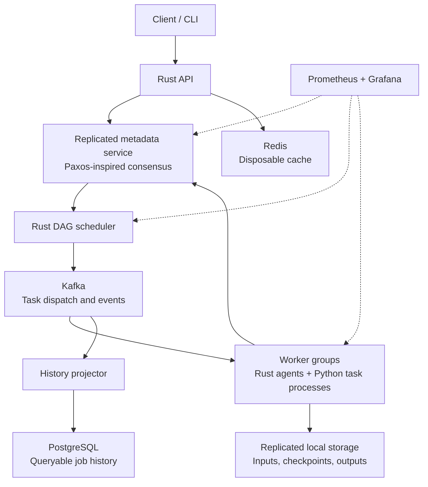

# Shardwise

Shardwise is a planned fault-tolerant distributed execution framework for AI and data-processing workloads. It will coordinate dependency-aware tasks through a Paxos-inspired metadata service, execute them across replicated worker groups, and recover from node failures.

The project is designed to run locally on Apple Silicon using free, open-source infrastructure. No cloud account, paid service, or GPU is required.

## Current status

The repository currently contains an initial Rust scaffold. The services, protocols, workloads, and guarantees described below are the implementation targets, not completed capabilities. The starter executable is not yet a working framework.

Implementation is divided into runnable baselines below. Start with **Baseline 1**; the detailed checklist is in [TODO.md](TODO.md). All baselines are currently planned.

## Goals

- Implement durable leader election and metadata consensus with strict-majority recovery.
- Separate replicated coordination metadata from replicated worker storage.
- Schedule task dependency graphs and recover interrupted work without publishing duplicate results.
- Demonstrate real AI and data-processing workloads, rather than only synthetic tasks.
- Measure throughput, latency, resource use, and recovery behavior under controlled failures.
- Keep development, demonstrations, and benchmarks entirely local and free.

## Target architecture



### Metadata and consensus

A separate metadata quorum will own authoritative coordination state: job graphs, task transitions, worker membership, replica placement, and accepted results.

The Paxos-inspired protocol will cover election, quorum-backed log replication, durable promises and accepted values, and replay after restart. A typical local configuration will use three metadata nodes, requiring two votes to make progress. A five-node configuration would require three votes.

Leader changes must preserve previously chosen values. Terms or ballots and fencing checks will prevent an obsolete leader or task attempt from committing new authoritative state. Nodes without a majority will stop metadata writes until quorum is restored; a minority must never elect itself into authority.

This targets crash and network-partition failures, not malicious nodes. Protocol safety and recovery will need deterministic tests and fault injection before these guarantees can be claimed as implemented.

### Hierarchical replicated storage

The metadata service will track data ownership and placement without storing bulk workload data in its consensus log. Worker groups will replicate task inputs, available checkpoints, and outputs across local disks belonging to distinct worker nodes.

Replica placement, acknowledgements, checksums, and repair will be explicit. A task result will become authoritative only after its configured storage durability requirement is satisfied and the metadata quorum accepts its commit. Metadata quorum size and data replication factor are separate settings.

After a worker fails, another worker can read surviving replicas and resume from a supported checkpoint or retry the task. Lost replicas will be rebuilt from surviving copies. If every copy of required data is lost, recovery requires a reproducible source or resubmission.

### Dependency-aware execution

Clients will submit directed acyclic graphs (DAGs) whose tasks declare dependencies, inputs, resource needs, and retry policies. The scheduler will reject cycles and release a task only after its prerequisites have committed successfully.

Rust worker agents will handle dispatch, storage, heartbeats, and task lifecycle management. Python processes will execute registered AI and data-processing task functions. The initial interface will support user-defined graphs built from registered task types; arbitrary untrusted code execution is outside the initial scope.

The first example workloads will be:

- **AI:** partitioned gradient computation for a small CPU model, followed by gradient aggregation and comparison with a single-process reference.
- **Data processing:** partitioned transforms and aggregations, with intermediate artifacts shared through replicated storage.

### Infrastructure responsibilities

| Component | Responsibility |
| --- | --- |
| Rust metadata service | Authoritative coordination state, leader election, consensus, durable recovery |
| Rust API and scheduler | Job submission, graph validation, dependency resolution, task placement |
| Rust worker agents | Task lifecycle, storage replication, health reporting, recovery |
| Python task processes | AI and data-processing implementations using native numerical libraries where useful |
| Kafka | Durable task dispatch and lifecycle events; delivery may be repeated |
| Redis | Disposable caching; cache loss must not invalidate authoritative state |
| PostgreSQL | Queryable job history and reporting projections; coordination authority remains in the metadata service |
| Prometheus and Grafana | Cluster health, workload metrics, and recovery visibility |
| Docker Compose | Reproducible local orchestration |

Kafka publication and metadata commits will require a recoverable publication workflow and reconciliation. Consumers will deduplicate repeated events. PostgreSQL projections may lag authoritative state, and APIs will distinguish historical views from authoritative status.

Rust is the default for performance-sensitive infrastructure. Python provides access to the AI and data ecosystem. Go can be introduced for a bounded component if measurements or a concrete library advantage justify another runtime; adding languages is not itself a performance optimization.

## Target failure and execution semantics

| Condition | Intended behavior |
| --- | --- |
| Metadata leader crashes | A surviving majority elects a leader and recovers chosen metadata |
| Metadata network partitions | Only a partition with a strict majority can advance authoritative state |
| Worker crashes or stops reporting | Work is reassigned after failure detection; stale attempts are fenced at commit |
| Task or event is delivered twice | Repeated execution is possible; authoritative result commits are deduplicated |
| Data replica fails | Read surviving copies and repair replication when capacity is available |
| Redis is unavailable | Bypass the cache and use durable sources |
| PostgreSQL is unavailable | History views may be unavailable or stale; projection resumes after recovery |
| Kafka is unavailable | Dispatch and event processing pause; durable coordination state supports reconciliation after recovery |

Execution will be **at least once**, with a single accepted result per logical task. This does not guarantee exactly-once execution or exactly-once effects in external systems. Tasks that write external state must provide their own idempotency mechanism.

An acknowledged result's survival depends on the configured replica durability policy and surviving disks. Running several containers on one laptop demonstrates process and simulated network failures; it does not protect against losing that laptop or its disk.

## Local development and deployment

All planned services will run on one Apple Silicon Mac through Docker Compose, using ARM64-compatible images and CPU workloads. Replica counts, worker concurrency, workload size, and observability services will be configurable to fit available memory.

No setup command is published yet because the runnable cluster has not been implemented. A working local quickstart will be added with the first end-to-end milestone.

## Implementation baselines

Each baseline builds on the previous one and ends with a runnable demonstration and explicit completion checks. The target architecture above describes the completed system; its fault-tolerance guarantees do not apply to the initial baseline.

### Baseline 1 — Submit, execute, retrieve

**Objective:** get the smallest complete job flow running locally.

```text
Client → Rust coordinator/API ← HTTP polling by Rust worker agent → Python task runner
                  ↑                         |
                  └──── result report ──────┘
```

Run one coordinator and one worker as separate processes. The coordinator owns an in-memory queue and job state. The worker claims one task at a time over HTTP, invokes a registered Python function through a JSON input/output contract, and reports success or failure. A job contains exactly one task in this baseline.

| Interface | Baseline 1 behavior |
| --- | --- |
| `GET /health` | Reports coordinator readiness |
| `POST /jobs` | Validates a registered task and input; returns `202` with a job ID |
| `GET /jobs/{id}` | Returns `queued`, `running`, `succeeded`, or `failed`, plus the result or error when available |
| Internal worker API | Atomically claims queued work and accepts a result only for its assigned attempt |

The first task is `sum_numbers`, with an input such as `{"numbers": [1, 2, 3, 4]}` and a result of `{"sum": 10}`. This intentionally small workload validates the execution path before adding AI dependencies. Unknown tasks, invalid inputs, and unknown job IDs return clear errors.

Python task failures and execution timeouts become failed jobs. Repeated reports for the same completed attempt are harmless; conflicting or unassigned reports are rejected. Coordinator restart loses jobs, and worker termination can leave a job running: durable state and automatic recovery arrive later.

**Included:** bounded input size, one-task worker concurrency, configurable local addresses, structured logs with job/attempt IDs, an end-to-end smoke test, and a documented native quickstart. Docker Compose is optional at this stage; Rust and Python are the only required runtimes.

**Deferred:** DAGs, automatic retries, durable storage, consensus, replication, Kafka, Redis, PostgreSQL, dashboards, checkpointing, and GPU workloads.

**Complete when:** a fresh local checkout can launch both processes, submit the example, retrieve `10`, observe a Python failure as a failed job, and pass the documented smoke test without paid services.

### Baseline 2 — Dependency-aware execution

Add validated DAG submissions, multiple workers, dependency output references, and bounded scheduling. Keep the single coordinator and direct HTTP transport while establishing task-state semantics. A failed prerequisite must block its dependents and produce a terminal failed job rather than leave it waiting forever.

**Complete when:** a partitioned data transform and aggregation produces the reference result across two workers; cycles and missing dependencies are rejected; dependent tasks never start before successful prerequisites.

### Baseline 3 — Durable metadata consensus

Replace in-memory coordination authority with three metadata nodes using the Paxos-inspired protocol. Implement durable ballots/promises, accepted values, log replication, leader recovery, replay, and authoritative reads. Scheduler decisions and task transitions must go through consensus. Keep cluster membership fixed initially.

**Complete when:** a two-node majority can continue after one metadata node fails; a minority cannot advance state; restart and leader replacement preserve chosen values. Deterministic tests must cover competing proposals, delayed messages, and partitions.

### Baseline 4 — Replicated artifacts and worker recovery

Separate bulk artifacts from metadata and replicate inputs and outputs across worker disks. Add checksums, durable replica acknowledgements, placement metadata, heartbeats, attempt fencing, bounded retries, and replica repair. Use two data copies on distinct workers for the first demo; commit results only after the configured data durability requirement is met. Checkpoint/resume support is a later extension; initial recovery reruns tasks from surviving inputs.

**Complete when:** losing one worker preserves acknowledged artifacts, interrupted work runs on a survivor, stale attempts cannot replace accepted results, and missing replicas are repaired when capacity returns.

### Baseline 5 — Kafka dispatch and operational views

Replace direct task polling with Kafka dispatch and lifecycle events while retaining the metadata quorum as authority. Add recoverable event publication, reconciliation, duplicate handling, Redis caching, PostgreSQL history projections, and Prometheus/Grafana monitoring. Provide an ARM64 Docker Compose setup with persistent volumes and optional observability services.

**Complete when:** broker interruption and repeated delivery do not lose committed task transitions or create conflicting results; cache loss is harmless; history catches up after PostgreSQL recovery; the local cluster can be started with documented commands.

### Baseline 6 — AI workloads and measured reliability

Add the CPU gradient-computation DAG and compare it with a single-process numerical reference. Package automated failure demonstrations and benchmarks for both AI and data-processing workloads. Record throughput, latency, resource use, and recovery time alongside hardware and configuration.

**Complete when:** both workloads produce validated results, failure scenarios are reproducible, and measured local results are published with their limits. Large-scale, multi-machine performance remains unclaimed without supporting measurements.

## Validation and performance

Correctness comes before optimization. Tests will exercise concurrent proposals, leader changes, partitions, restarts, delayed messages, duplicate deliveries, and stale workers. Storage checks will cover corrupted or missing replicas and recovery from surviving copies.

Benchmarks will report task throughput, end-to-end and scheduling latency, metadata commit latency, recovery time, replication overhead, and CPU and memory use. Every result will include hardware, workload, payload sizes, concurrency, replica counts, and comparison with a single-worker baseline.

The performance goal is efficient execution with demonstrated improvements, not an unsupported claim to be the fastest framework. Local experiments can establish correctness and scaling behavior within one machine; claims about large-scale, multi-machine operation require corresponding evidence.


## Author

**Ved Panse** — [vedpanse.com](https://vedpanse.com)
